<div align="center">

# Franklink

**The world's first AI-native professional network, built entirely inside iMessage.**

No app to download. No sign-up form. You text a contact named *Frank*, and a multi-agent system onboards you, learns what you need and what you offer, and introduces you to the right people, one-on-one and in AI-formed group chats.

<p>
  
  
  
  
  
  
  
</p>

</div>

---

## What Is Franklink?

Traditional professional networks make you download an app, build a profile, and cold-message strangers. Franklink inverts that: it lives where people already talk, namely **iMessage**, and does the networking *for* you.

You text Frank like a friend. Behind that single thread, a **conductor agent** reads each message, decides what needs to happen, and dispatches specialized **sub-agents** that onboard you, extract what you need and what you can offer, search a knowledge graph of other members, and broker introductions. When two people match, Frank spins up a group chat and drops in an AI-generated icebreaker. The product surface is a text bubble; the system behind it is a distributed, event-driven multi-agent platform.

| Capability | What it does |
|---|---|
| **Need & Value matching** | Captures what you're looking for (interviews, co-founders, advice) and what you offer, embeds both, and matches you with complementary members. |
| **Email context intelligence** | With read-only Gmail access (via Composio OAuth), Frank learns you're attending a conference or taking a course, then matches on real-world activity. |
| **Location-aware networking** | Matches by university, city, or event for in-person collaboration and study sessions. |
| **AI-formed group chats** | Creates multi-person chats with context-rich icebreakers drawn from members' shared interests. |

---

## Product Walkthrough

The entire experience happens in a normal iMessage thread. These are real screens from the product.

<p align="center">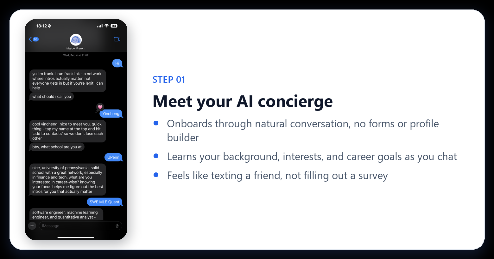</p>
<p align="center">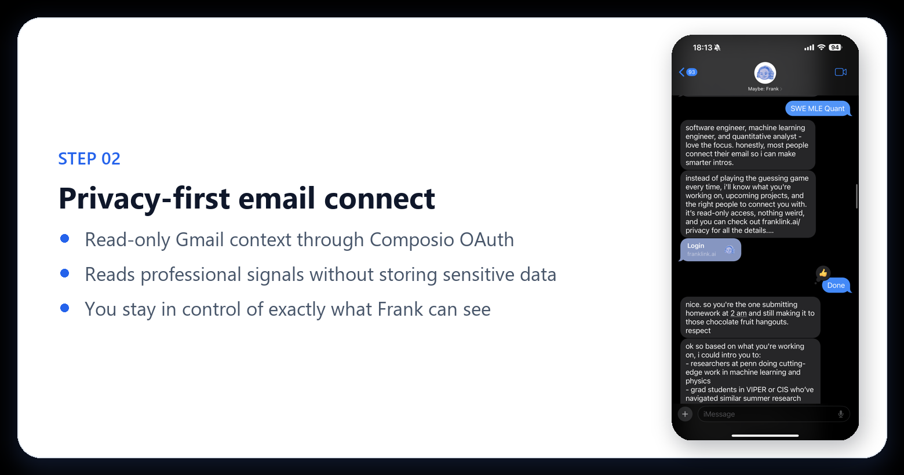</p>
<p align="center">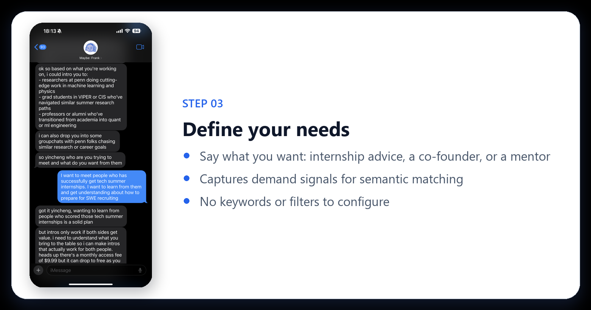</p>
<p align="center">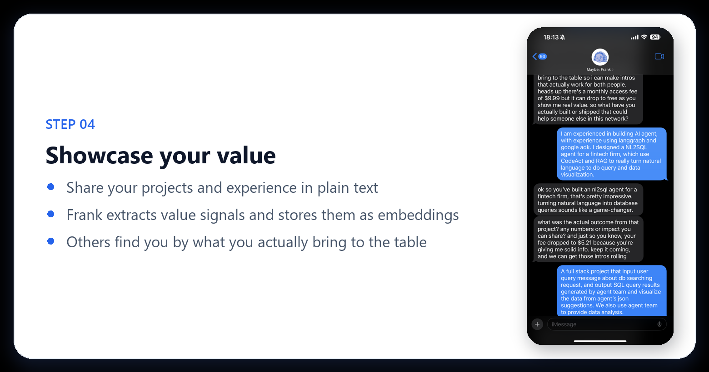</p>
<p align="center">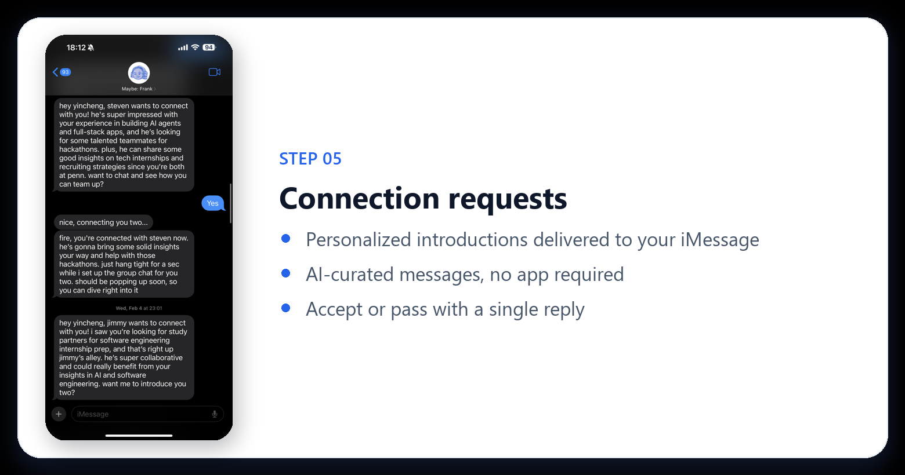</p>
<p align="center">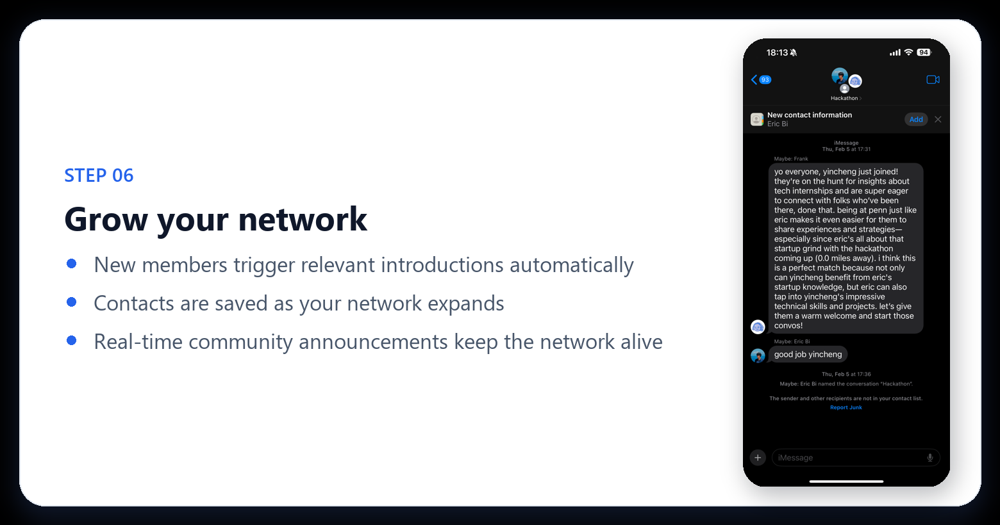</p>
<p align="center">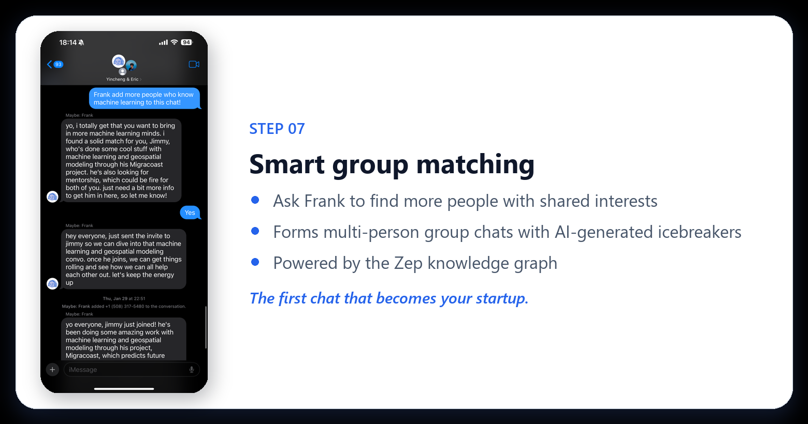</p>

---

## How It Works

A message travels from iMessage through a durable event pipeline to a pool of stateless agent workers, then back, typically in a couple of seconds.

<p align="center">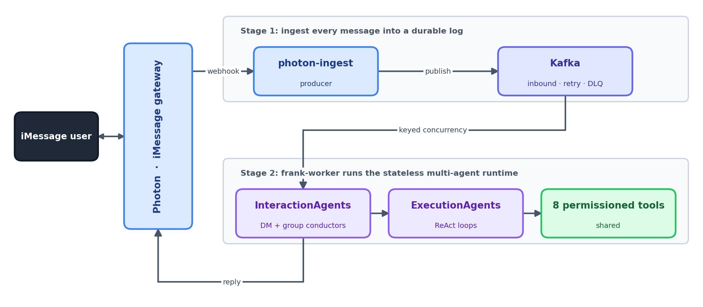</p>

**Four services** run together (see [`docker-compose.yml`](docker-compose.yml)):

| Service | Role |
|---|---|
| `photon-ingest` | Receives inbound iMessage events from Photon and publishes them to Kafka |
| `kafka` (+ `zookeeper`) | Durable, partitioned event log with dedicated retry and DLQ topics |
| `frank-worker` | Consumes events, runs the multi-agent orchestrator, sends replies |
| `background-workers` | Group-chat summaries and followups, daily email context, proactive outreach, profile synthesis |

---

## Multi-Agent Architecture

Franklink uses a **conductor / executor** design across three layers. Two **InteractionAgent** conductors, one for direct messages and one for group chats, are the only components that ever produce user-facing text. Each classifies intent and *selectively dispatches* to the execution agents in its scope: the DM conductor drives **Onboarding**, **Networking**, and **Update**; the group-chat conductor drives **Update** plus the two **Group-chat** agents (networking and maintenance). **Update** is shared by both. Every execution agent runs a ReAct loop over the **same 8 permissioned tools** and returns **structured data only**.

<p align="center">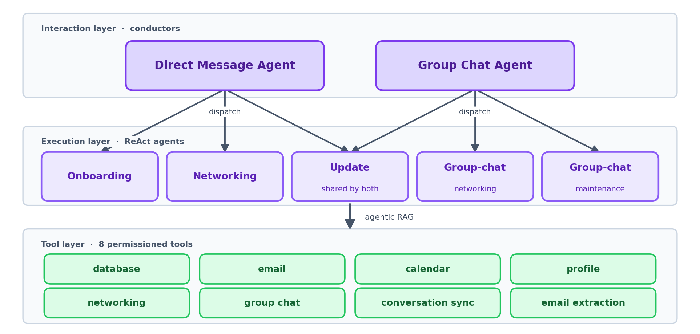</p>

Memory is **stateless by request**: there are no graph checkpoints to serialize. Each message rebuilds context from a 50-message sliding window (InteractionMemory) plus long-term facts from the **Zep knowledge graph** and **Supabase** profiles, with a per-task ExecutionMemory scratchpad and a persistent TaskHistorySaver. Workers scale horizontally without sticky state.

---

## Distributed Systems & Performance

The hard problem is not the LLM calls. It is delivering thousands of users' messages **reliably and concurrently** over an inherently bursty, out-of-order channel, while keeping a conversational feel.

### Selective dispatch: about 30% lower user-facing latency

Routing each message to only the relevant ExecutionAgent, instead of fanning out to all five sub-agents, collapses the execution path and cuts user-facing response time by roughly a third.

<div align="center">
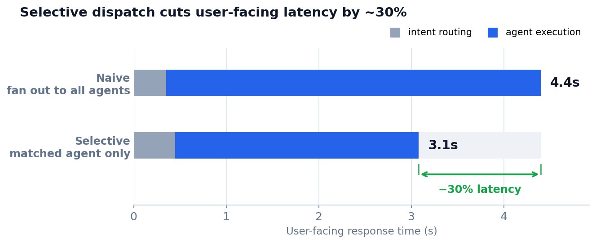
</div>

### The orchestrator stays off the critical path

Each message is a handful of sequential `gpt-4o-mini` round-trips, and the runtime is I/O-bound: it `await`s those calls instead of burning CPU. So the **single-session p99 baseline is dominated by irreducible LLM time**, the latency you would pay even with one user. The distributed system's job is to add as little as possible on top of that.

To measure it, a closed-loop load test runs **100 concurrent sessions** across **10 ECS workers**, each session behaving like a real user: send a message, wait for the reply, pause ~10 s to think, then send again. Under that load, p99 lands at **1.39× the single-session p99 baseline**: roughly **40% of added overhead**, the rest unchanged. Keyed concurrency keeps each conversation in order while different conversations run in parallel, so the LLM API, not the orchestrator or the queue, stays the bottleneck.

<div align="center">
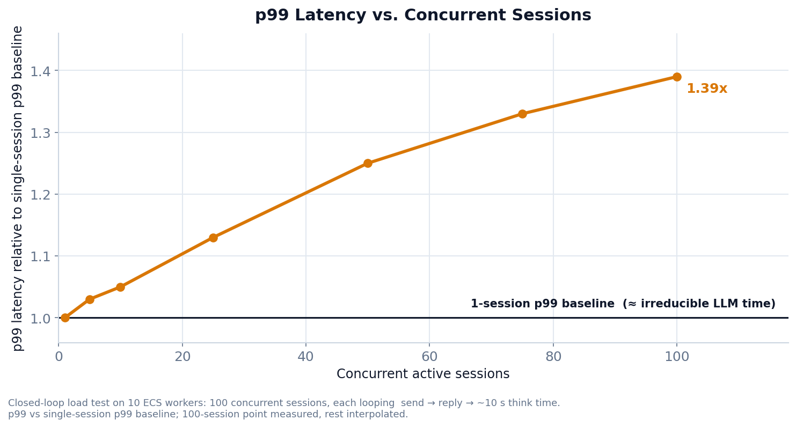
</div>

This characterizes concurrent *active* sessions (bursty, mostly idle) **within provisioned Azure OpenAI capacity**. Under sustained rate-limit throttling, tiered retry queues take over: they preserve delivery, not latency.

### At-least-once delivery with a 3-tier retry and DLQ

The producer runs with idempotence (`acks=all`); the consumer commits offsets manually and dedupes on **Redis idempotency keys (24 h TTL)**. Transient failures cascade through dedicated retry topics with exponential backoff. Anything that exhausts 6 attempts is parked in a dead-letter queue. Nothing is dropped, nothing is silently re-processed.

<div align="center">
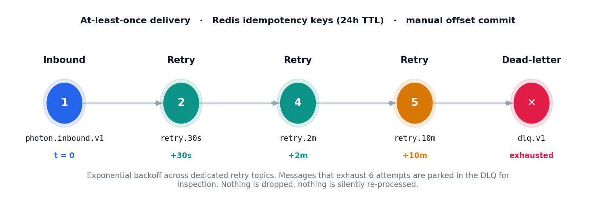
</div>

**Key tuning constants** (from [`app/config.py`](app/config.py) and [`app/integrations/kafka_pipeline.py`](app/integrations/kafka_pipeline.py)):

| Concern | Setting | Value |
|---|---|---|
| Topics | inbound + retry tiers + DLQ | `inbound.v1`, `retry.30s/2m/10m`, `dlq.v1` |
| Partitioning | partitions × replication | 12 × 3 |
| Concurrency | max in-flight per consumer | 20 |
| Ordering | partition key | `chat_guid` (group) / `from_number` (DM) |
| Retries | max attempts before DLQ | 6 (30 s, 2 m, 10 m) |
| Idempotency | Redis key TTL | 24 h |
| Coalescing | debounce / max window | 1.5 s / 10 s |
| Backpressure | commit-gap pause / resume | 500 / 200 offsets |

---

## Tech Stack

| Layer | Technologies |
|---|---|
| **API & runtime** | Python 3.11, FastAPI, Uvicorn, Pydantic Settings |
| **Messaging** | Photon iMessage gateway (Socket.IO + REST): typing, reactions, attachments |
| **Event pipeline** | Apache Kafka (`aiokafka`), AWS MSK with IAM SASL auth, Redis |
| **Agents & LLM** | Custom conductor/executor orchestration (ReAct), Azure OpenAI (GPT-4o / GPT-4o-mini) |
| **Memory & data** | Zep knowledge graph, Supabase (Postgres + pgvector), dual database (app + resources) |
| **Integrations** | Composio (read-only Gmail + Google Calendar), Google Places, Stripe |
| **Infra** | Docker Compose (local), AWS ECS (prod), supervisord, Sentry |

---

## Project Structure

```text
Franklink-iMessage/
├── app/
│   ├── main.py                 # FastAPI app: webhooks, lifespan, service wiring
│   ├── orchestrator.py         # MainOrchestrator: message entry point
│   ├── agents/
│   │   ├── interaction/        # InteractionAgent (conductor), the only user-facing voice
│   │   ├── execution/          # GenericExecutionAgent, the ReAct task runner
│   │   ├── tasks/              # Onboarding, Networking, GroupChat, Update task defs
│   │   ├── tools/              # 8 permissioned tools (agentic RAG)
│   │   ├── memory/             # ExecutionMemory, InteractionMemory, TaskHistorySaver
│   │   └── queue/              # AsyncOperationProcessor (long-running ops)
│   ├── integrations/
│   │   ├── kafka_pipeline.py   # Producer, consumer, keyed concurrency, retry/DLQ
│   │   ├── photon_client.py    # iMessage send, typing, reactions, attachments
│   │   ├── zep_*               # Knowledge-graph memory and graph matching
│   │   └── composio_client.py  # Read-only Gmail and Calendar
│   ├── groupchat/              # Group routing, icebreakers, summaries, followups
│   ├── proactive/              # Daily email context, location, outreach
│   ├── services/               # Message coalescer, cancellation tokens
│   ├── workers/ · jobs/        # Background supervisor, profile synthesis
│   └── database/ · models/     # Supabase clients, typed state schemas
├── infrastructure/aws/         # ECS task defs, deploy scripts, architecture docs
├── migrations/                 # SQL schema and RPC migrations (MIGRATION_ORDER.md)
├── tests/                      # e2e and smoke suites, Kafka load test
├── scripts/                    # Backfills, ops utilities, attachment sidecar (Node)
├── docs/                       # Architecture notes, plans, charts, screenshots
├── docker-compose.yml · Dockerfile
└── requirements.txt · pytest.ini
```

---

## Getting Started

### Prerequisites

- Docker Desktop + Docker Compose
- A Photon account (iMessage gateway) and API key
- Supabase project, Azure OpenAI deployment, and Zep API key
- *(optional)* Composio (Gmail/Calendar) and Stripe keys

### Configure

```bash
cp .env.example .env   # fill Photon, Supabase, Azure OpenAI, Zep (plus optional Composio/Stripe)
```

### Run with Docker

```bash
docker compose up --build
```

This starts Zookeeper, Kafka, the ingest producer, the worker (orchestrator + consumer), and the background workers. The API is exposed on `http://localhost:8000`; check `http://localhost:8000/health`.

### Run locally (single process)

```bash
python -m venv venv && source venv/bin/activate   # Windows: venv\Scripts\activate
pip install -r requirements.txt
uvicorn app.main:app --reload
```

In single-process mode set `PHOTON_INGEST_MODE=listener` and `PHOTON_CONSUMER_MODE=off` to bypass Kafka and handle messages inline.

### Tests

```bash
pytest                                               # unit + integration
python tests/kafka_concurrency_load_test.py --help   # concurrency load generator
```

---

<div align="center">

Built by **[Yincheng Zhou](https://github.com/ArtysicistZ)** &middot; [Product demo](https://artysicistz.github.io/projects/franklink-demo.html) &middot; [Technical write-up](https://artysicistz.github.io/projects/franklink.html)

<sub>The first chat that becomes your startup.</sub>

</div>
